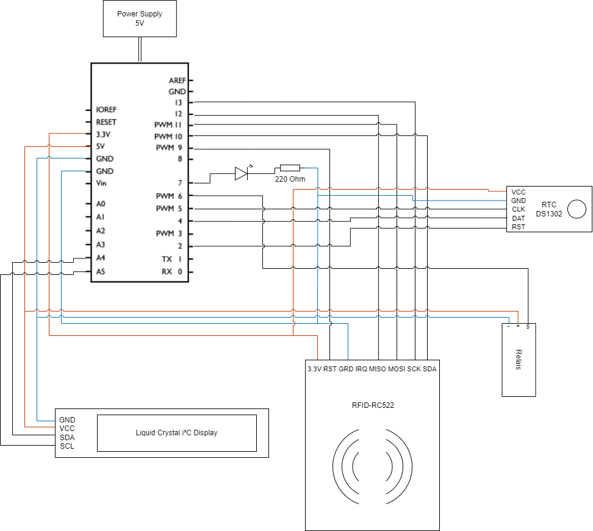
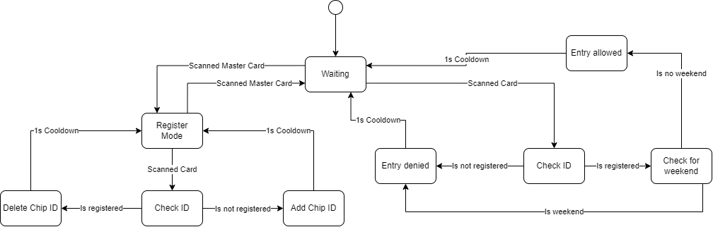

# Embedded Systems (EBS) Project - RFID Sensor
This project was for the EBS-Course at my University. Our goal was to develop an RFID-Door opener for a fictional company, which should open the door (click the Relais) if a valid RFID-Card has been presented and the employer is allowed to come in at the current time.

# Hardware
- Power Suply
- Arduino Uno
- RTC DS1302
- RFID RC522
- Relais
- Liquid Crystal i²C Display

## Circuit Diagram

# Software
The project is divided into 5 Files:
- embdSysProject.ino -> This is the main starting point of this project and calls functions out of the other files as well as to set up any other parts besides the ones specified in the files.
- display.ino -> Contains the code to setup and print something to the display.
- rfid.ino -> Contains the code to setup and read from the RFID-Reader. Is also responible for deciding the response whenever an RFID Card has been scanned.
- rtc.ino -> Contains the code to setup and read from the rtc.
- timer.ino -> Contains the code to start an timer, which finishes with an interrupt. This part was mandatory for passing this course, because we should learn how to controll the registers directly.

### Master Card
The master card is used to add and remove allowed rfid codes to the system. The code of the master card is defined inside the rfid.ino file as the `MASTER_ID` constant. Please change it.

## State Diagram

